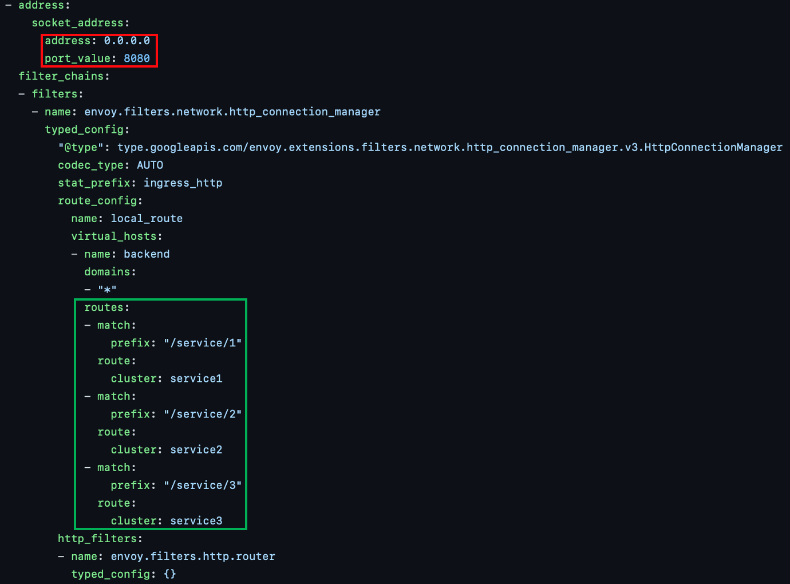
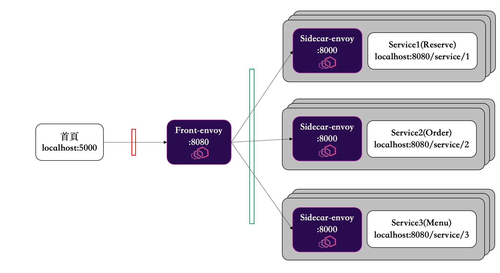

# Distributed menu service
This is a National Chengchi Univercity Distributed System Finals Demo.

In ```fronyenvoy.yaml```:
<br>



Represents the follwoing struture:
<br>


## Run the service

Start the Docker compose.

    docker-compose build --pull
    docker-compose up -d
    
Check the status of the containers.

    docker-compose ps

Scale up the service.

    docker-compose scale service1=3

Run the server.

    python3 service.py
